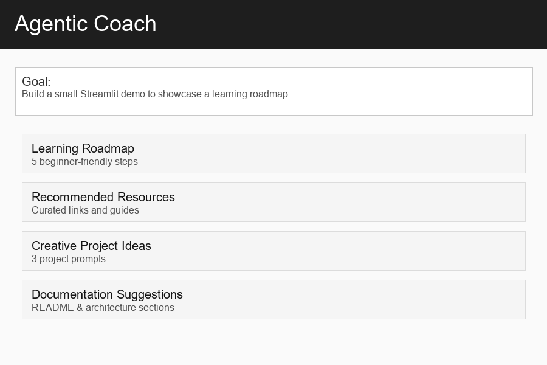
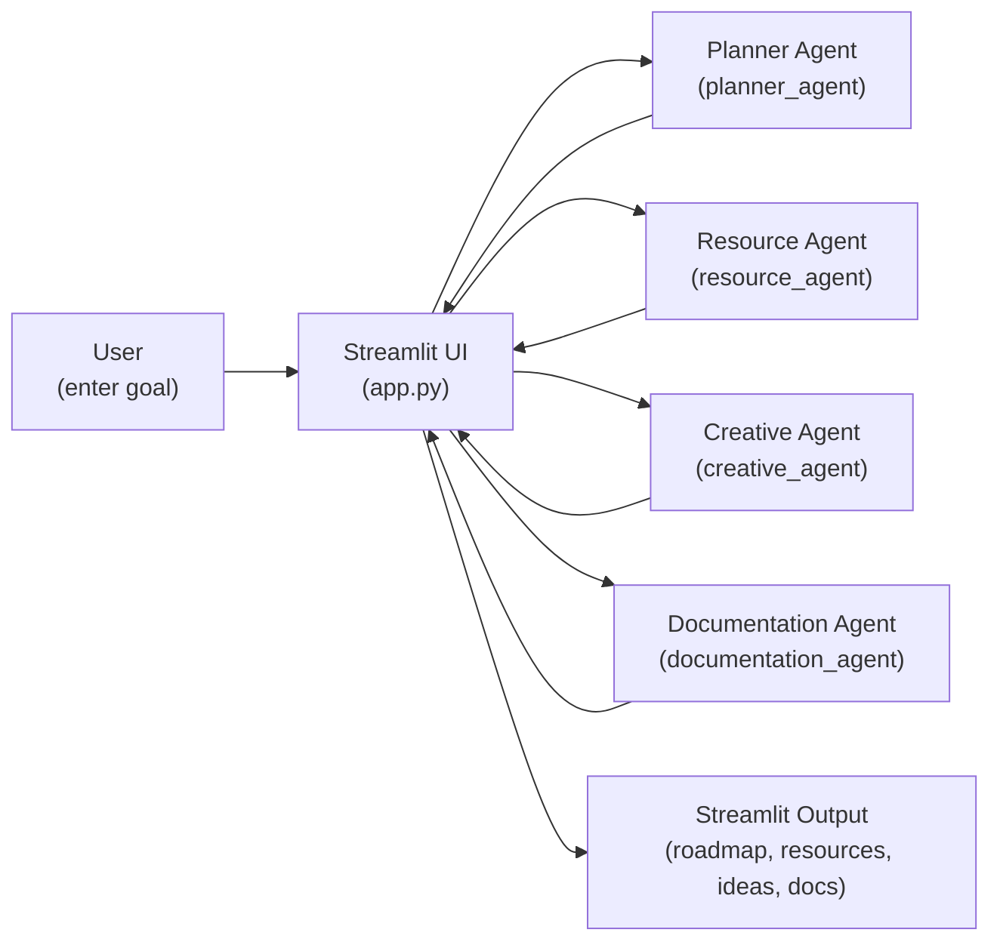

# Agentic Coach

Agentic Coach is a lightweight Streamlit application developed for **Microsoft Agents League Battle #1: Creative Apps**.

The app helps users turn a learning or project goal into:

* a beginner-friendly learning roadmap
* curated learning resources
* creative project ideas
* documentation suggestions

No external APIs or LLM calls are used in the current version. The project focuses on a simple, testable, agentic workflow built with Python, Streamlit, and GitHub Copilot.

## Demo

The app runs locally with Streamlit.

Example goal:

```text
AI Engineer
```

Generated sections:

1. Learning Roadmap
2. Recommended Resources
3. Creative Project Ideas
4. Documentation Suggestions

### Demo GIF



A short animated demo of the Streamlit UI showing the Learning Roadmap, Recommended Resources, Creative Project Ideas, and Documentation Suggestions sections.

## Agent Workflow

```text
User Goal
↓
Streamlit Interface
↓
Planner + Resource + Creative + Documentation Agents
↓
Final Agentic Plan
```

## Architecture



A user types a short learning or project goal into the Streamlit UI; the app calls each agent with the same goal string. Each agent returns deterministic, display-ready data which the app renders inside expandable sections for the user to read, copy, or act on. See [docs/architecture.md](docs/architecture.md) for a more detailed diagram and explanation.

## Agents

### Planner Agent

Generates a five-step beginner-friendly roadmap from a user goal.

### Resource Agent

Recommends curated learning resources from Microsoft Learn, GitHub Copilot documentation, Agents League resources, and O'Reilly.

### Creative Agent

Generates creative project ideas based on the user's goal.

### Documentation Agent

Suggests README, architecture, testing, and references sections for a project.

## Technology Stack

* Python
* Streamlit
* pytest
* GitHub Copilot
* Visual Studio Code

## How to Run Locally

Create and activate a virtual environment:

```powershell
python -m venv .venv
.\.venv\Scripts\Activate.ps1
```

Install dependencies:

```powershell
pip install -r requirements.txt
```

Run the app:

```powershell
streamlit run app.py
```

## Running Tests

```powershell
pytest
```

## Development Approach

This project follows GitHub Copilot prompt engineering and AI-assisted development practices.

GitHub Copilot was used for:

* project scaffolding
* agent implementation
* unit test generation
* documentation support
* Streamlit integration

All generated code was reviewed before being included.

## Documentation

* Architecture: `docs/architecture.md`
* Learning Log: `docs/learning-log.md`
* Copilot Usage: `docs/copilot-usage.md`
* References: `docs/references.md`

## References

See `docs/references.md`.