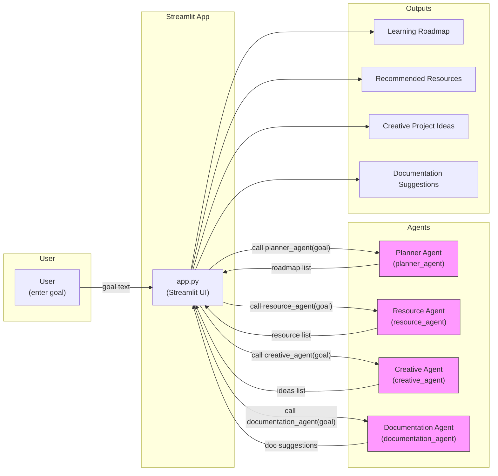

# Architecture

**Explanation**

- User enters a short learning or project goal into the Streamlit UI (`app.py`).
- The Streamlit app calls each agent function with the same `goal` string:
	- `planner_agent` → produces a five-step learning roadmap.
	- `resource_agent` → returns recommended learning resources.
	- `creative_agent` → suggests three creative project ideas.
	- `documentation_agent` → suggests README, architecture, testing, and references sections.
- Each agent returns deterministic, display-ready data that the Streamlit app renders inside expandable sections for the user to read, copy, or act on.

This diagram and explanation are suitable to include in the project README or `docs/architecture.md` on GitHub.

